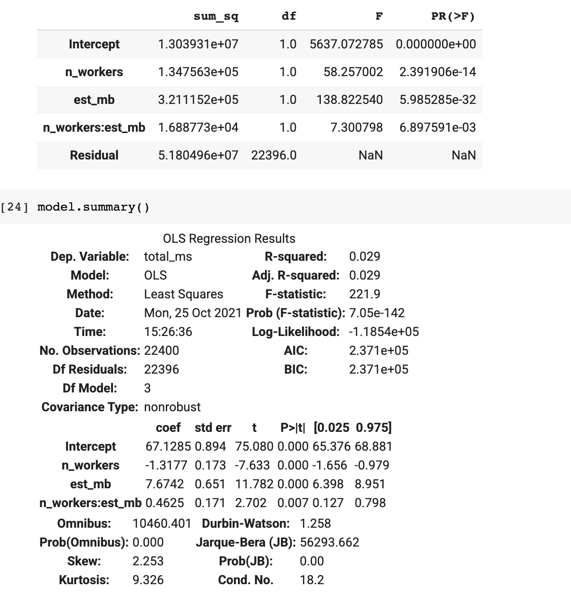
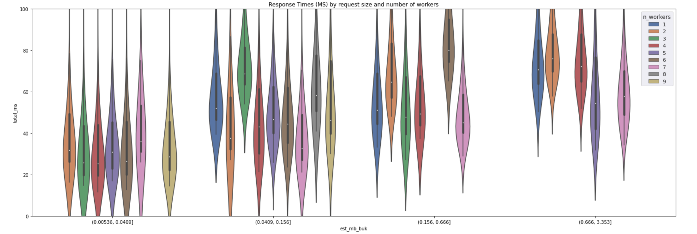
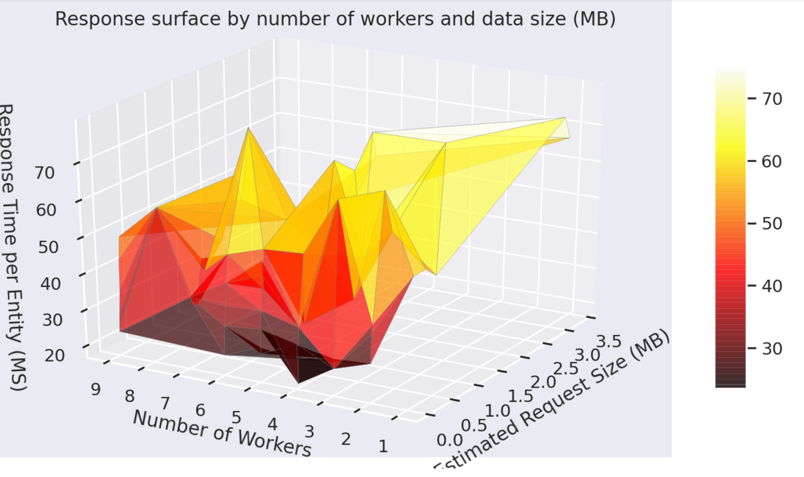

# Featurestore Tester

The objective of this app is to 
1) Show how to load and use FeatureStore via the Vertex SDK
2) Provide a performance test with the `run_experiment.py` application


## Load FS

### [`00_load_data_to_bq.ipynb`](00_load_data_to_bq.ipynb) 
This notebook downloads the movielens and imbdb datasets then creates a simple testing dataset of over 150k movies.

### [`01_feature_store.ipynb`](01_feature_store.ipynb)
This notebook creates a movies featurestore and loads movies and user review entities into a featurestore. The notebook ends with making streaming calls to the featurestore.

## Test Featurestore Latency and Load times

### [`run_experiment.py`](run_experiment.py)

This (along with `Factorial-Design.ipynb`) tests featurestore's load and request latency. `doepy` is used to construct the tests. Recommended to load via terminal background process or `nohup` call.

Usage: for long running do a background process to run:

```nohup python run_experiment.py --N_ITERATIONS <> --N_WORKERS <> \
 --N_MEASURES <> --N_REPEAT_MEASURES --N_PREDICTIONS <> \
 --PROJECT_ID <> --BUCKET <> \
 --BQ_DATASET movielens --REGION <> --FEATURESTORE_ID <>```
 
 Data will be generated for each run in `data/` and will accumulate measurments
 
 Parameters:
 
  - N_FEATURES: number of features, incremented in chunks of 7 varaibles
  - N_PREDICTIONS: Number of rows to load and request
  - N_WORKERS: Number of workers configured on the featurestore
  - N_REPEAT_MEASURES: Number of times to execute latency measurments per config
  - FEATURESTORE_ID: The name of the featurestore that will be recreated for the test

Outputs:

- `FS Load From BQ`: Number of seconds it takes to load the FS with the specified features and rows
- `total_seconds`: Response in seconds for specified request

# DOE Analysis

Review the analysis tab for:

## Anova



## Response Analysis



## Response Surface Visualiztion (median)




